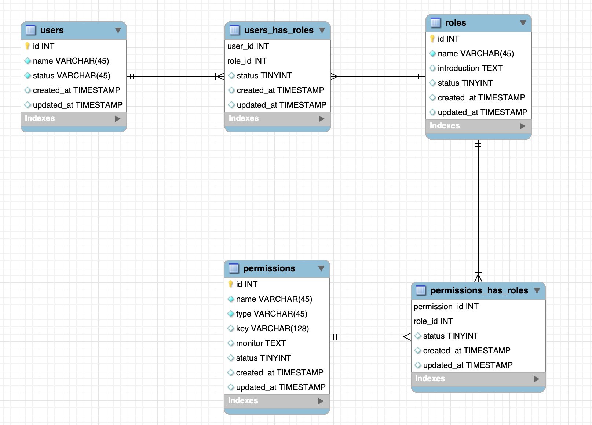

# 详细设计文档

## 需求解读
1. 系统存在多种角色（role）；
2. 不同的角色有不同权限，即系统行为、查看页面、查看页面元素（permission）；
3. 用户在使用权限时都需要得到校验，即需要经过一层中间件进行鉴权；

存在的实体有：用户-user、角色-role、权限-permission

存在的关系有：用户角色关系-user_role、角色权限关系-role_permission

后端存在 api 鉴权中间件：permission-middleware

前端应该也有中间件

## 逻辑设计
节点结构体
```
type Node struct{
    Id int  // id
    Key string // 关键字
    Status int // 是否需要鉴权
    Method string // 请求类型，看 permission 中的 monitor 字段
    Level int // 第几层，初始化时为 0
    Children []Node // 拥有的子节点数组
}
```

生产 API 权限前缀树：
1. 获取所有权限，并组成特定的数节点结构体；
2. API 接口按严格 RESTFUL 的规范走，初始化，delete、get、post、put 4 个权限树；
3. 根据不同的 method 插入到不同的权限树中；

API 权限前缀树的插入规则：
1. 将 API 按 '/' 为分隔符将 uri 拆掉为多个字符串，例：访问 /a/b/c
   - /a/b/c => ["","a","b","c"]
2. 遍历 ["","a","b","c"] 为 str, 检查权限树 children 中是否存在 treeNode 的 key 是否与 str[i] 之匹配，若匹配则将 leaf=treeNode，children=treeNode.children，i++, 进行下一轮匹配;否则，退出循环返回 lead；
3. 得到 leaf 后若 leaf 的 level 长度等于 str 长度时，表示 leaf 为 str 的完整匹配路径，此时需要将 leaf 的 id 设置为 node 的 id, status同理；
4. 若 leaf 的 level 小于 str 长度时，需要沿着改节点创建子节点。

生成权限树时的匹配规则：
- API key 中没有 ':' 开头，表示需要完全匹配，即 a == b；
- 存在 ':' 是模糊匹配，即 a = ":abc", b = ":vvv", 此时会标记为 a like b，但不会马上退出循环，直到 children 遍历完为止；
- 全匹配的权重高于模糊匹配

API 鉴权时的匹配规则，a为权限树，b为访问路径：
- API key 中没有 ':' 开头，表示需要完全匹配，即 a == b；
- 存在 ':' 是模糊匹配，即 a = ":abc", b = "vvv", 此时会标记为 a like b，但不会马上退出循环，直到 children 遍历完为止；
- 全匹配的权重高于模糊匹配

API 鉴权：
1. 将 API 按 '/' 为分隔符将 uri 拆掉为多个字符串，例：访问 get /a/b/c
   - /a/b/c => ["","a","b","c"] str 
2. 拿出 "" 与 tree[get].key 就行比较若不匹配表示没有该权限不在权限范围内，no manager；
3. 若找到 node，且 node.id != 0 && node.status == 0 时，表示该权限是自由使用的，free；
4. 若找到 node，且 node.id != 0 && node.status == 1 时，表示该权限是需要被监控的，若此时用户的有效角色与该权限存在有效关系时，authorization；否则 no permission。

页面访问鉴权：
1. 用户一登录就间用户可以看到的所有页面返回给前端，由前端控制用户是否可以访问。

页面元素鉴权：
1. 当用户进入页面时，需要向后端发起请求获取页面元素展示权限，获得后由前端自行限制。


## 数据表设计



相关脚本：
```sql
-- -----------------------------------------------------
-- Table `users`
-- -----------------------------------------------------
DROP TABLE IF EXISTS `users` ;

CREATE TABLE IF NOT EXISTS `users` (
  `id` INT NOT NULL AUTO_INCREMENT,
  `name` VARCHAR(45) NOT NULL,
  `status` VARCHAR(45) CHARACTER SET 'DEFAULT' NOT NULL DEFAULT 'frozen' COMMENT '状态，activated 激活状态，frozen 冻结状态',
  `created_at` TIMESTAMP NULL DEFAULT CURRENT_TIMESTAMP COMMENT '创建时间',
  `updated_at` TIMESTAMP NULL DEFAULT NULL ON UPDATE CURRENT_TIMESTAMP COMMENT '更新时间',
  PRIMARY KEY (`id`))
ENGINE = InnoDB
COMMENT = '用户表';

-- -----------------------------------------------------
-- Table `roles`
-- -----------------------------------------------------
DROP TABLE IF EXISTS `roles` ;

CREATE TABLE IF NOT EXISTS `roles` (
  `id` INT NOT NULL AUTO_INCREMENT,
  `name` VARCHAR(45) NOT NULL,
  `introduction` TEXT NULL COMMENT '角色介绍',
  `status` TINYINT NULL COMMENT '角色的状态，0表示禁用，1表示使用',
  `created_at` TIMESTAMP NULL DEFAULT CURRENT_TIMESTAMP,
  `updated_at` TIMESTAMP NULL DEFAULT NULL ON UPDATE CURRENT_TIMESTAMP,
  PRIMARY KEY (`id`))
ENGINE = InnoDB;

-- -----------------------------------------------------
-- Table `permissions`
-- -----------------------------------------------------
DROP TABLE IF EXISTS `permissions` ;

CREATE TABLE IF NOT EXISTS `permissions` (
  `id` INT NOT NULL AUTO_INCREMENT,
  `name` VARCHAR(45) NOT NULL,
  `type` VARCHAR(45) NOT NULL DEFAULT 'api' COMMENT '类型：api 接口、page-view 页面、page-item 页面元素',
  `key` VARCHAR(128) NULL COMMENT '匹配关键字，api 使用 uri，page-view 使用path，page-item 使用 path ',
  `monitor` TEXT NULL COMMENT '监控的参数，api 监控请求方法（get/put/post/delete），page-view 无，page-item 监控字符串数组[‘a’,’b’] 并由前端决定是否展示，',
  `status` TINYINT NULL COMMENT '是否需要监控，0不需要，1需要',
  `created_at` TIMESTAMP NULL DEFAULT CURRENT_TIMESTAMP,
  `updated_at` TIMESTAMP NULL DEFAULT NULL ON UPDATE CURRENT_TIMESTAMP,
  PRIMARY KEY (`id`))
ENGINE = InnoDB;

-- -----------------------------------------------------
-- Table `users_has_roles`
-- -----------------------------------------------------
DROP TABLE IF EXISTS `users_has_roles` ;

CREATE TABLE IF NOT EXISTS `users_has_roles` (
  `user_id` INT NOT NULL,
  `role_id` INT NOT NULL,
  `status` TINYINT NULL COMMENT '状态，是否使用，0关闭，1使用',
  `created_at` TIMESTAMP NULL DEFAULT CURRENT_TIMESTAMP,
  `updated_at` TIMESTAMP NULL DEFAULT NULL ON UPDATE CURRENT_TIMESTAMP,
  PRIMARY KEY (`user_id`, `role_id`),
  INDEX `fk_users_has_roles_roles1_idx` (`role_id` ASC),
  INDEX `fk_users_has_roles_users1_idx` (`user_id` ASC))
ENGINE = InnoDB;


-- -----------------------------------------------------
-- Table `permissions_has_roles`
-- -----------------------------------------------------
DROP TABLE IF EXISTS `permissions_has_roles` ;

CREATE TABLE IF NOT EXISTS `permissions_has_roles` (
  `permission_id` INT NOT NULL,
  `role_id` INT NOT NULL,
  `status` TINYINT NULL COMMENT '使用状态，1使用，0不使用',
  `created_at` TIMESTAMP NULL DEFAULT CURRENT_TIMESTAMP,
  `updated_at` TIMESTAMP NULL DEFAULT NULL ON UPDATE CURRENT_TIMESTAMP,
  PRIMARY KEY (`permission_id`, `role_id`),
  INDEX `fk_permissions_has_roles_roles1_idx` (`role_id` ASC),
  INDEX `fk_permissions_has_roles_permissions1_idx` (`permission_id` ASC))
ENGINE = InnoDB;
```
